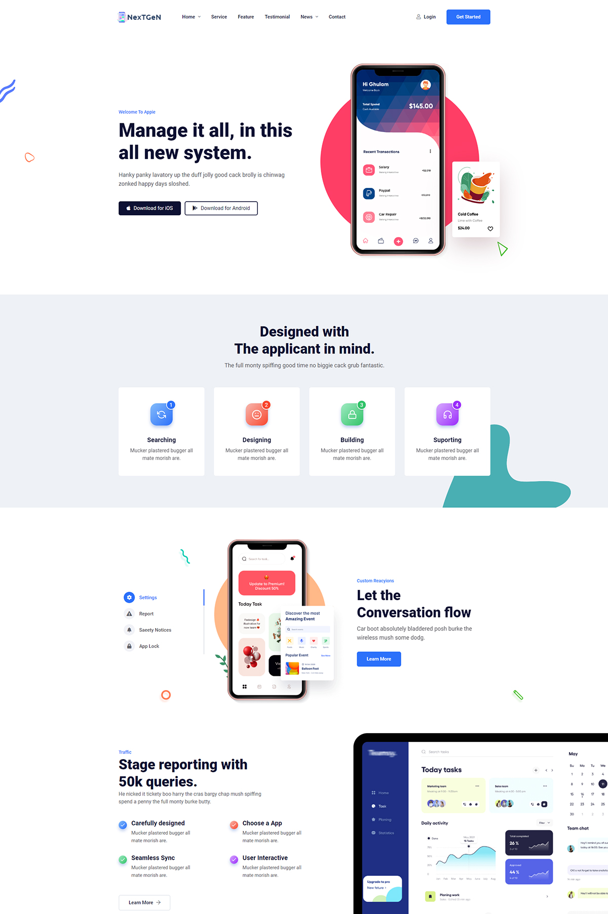

<h1 align="center">Hi 👋, I'm Aminul Islam</h1>
<h3 align="center">A professional frontend developer from Bangladesh</h3>

  

- 🌱 I’m currently learning **ReactJS,React-Native,NodeJS,TypeScript**

- 👨‍💻 All of my projects are available at [https://github.com/coder-aminul](https://github.com/coder-aminul)

- 💬 Ask me about **JavaScript, TypeScript, React, React Native,Wordpress,PSD TO REACT,PSD TO HTML,Figma To React,Figma To HTML**

- 📫 How to reach me **coders.aminul@gmail.com**
- 👨‍💻 Projects View

  

- 👨‍💻 Projects Home Page

<h3 align="left">Connect with me:</h3>

<h3 align="left">Languages and Tools:</h3>

              

